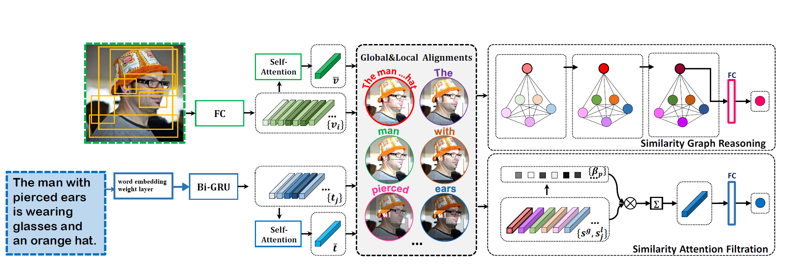

# SGRAF_W2V
*Python 3.6 and pytorch implementation of paper paper of [**“Similarity Reasoning and Filtration for Image-Text Matching”**](https://arxiv.org/pdf/2101.01368.pdf).*  with an added embedding layer 

*the authors of the original paper build the code based of [SCAN](https://github.com/kuanghuei/SCAN) 


## Introduction

**The framework of SGRAF with an added embedding layer:**



## Requirements 
To run the code in your local we recomment  *** `python3.6`***.
* cd to the directory where requirements.txt is located.
* activate your virtualenv.
* run: pip install -r requirements.txt in your shell.

## Download data and vocab
We follow [SCAN](https://github.com/kuanghuei/SCAN) to obtain image features, proccessed vobularies with gensim can be download from GDrive link

```proccessed image and captions
wget https://scanproject.blob.core.windows.net/scan-data/data.zip
wget https://scanproject.blob.core.windows.net/scan-data/vocab.zip
```
Vocab processed 
```bash
https://drive.google.com/file/d/1-34Hswgys9quEnHNIy0pRoT2IcoHEKVU/view?usp=sharing
```

## Pre-trained models and evaluation
Modify the **model_path**, **data_path**, **vocab_path** in the `evaluation.py` file. Then run `evaluation.py`:

```bash
python evaluation.py
```

Note that `fold5=True` is only for evaluation on mscoco1K (5 folders average) while `fold5=False` for mscoco5K and flickr30K. Pretrained models and Log files can be downloaded from [Flickr30K_SGRAF](https://drive.google.com/file/d/1OBRIn1-Et49TDu8rk0wgP0wKXlYRk4Uj/view?usp=sharing) 

## Training new models from scratch
Modify the **data_path**, **vocab_path**, **model_name**, **logger_name** in the `opts.py` file. Then run `train.py`:


For Flickr30K:

```bash
(For SGR) python train.py --data_name f30k_precomp --num_epochs 80 --lr_update 30 --module_name SGR
```


